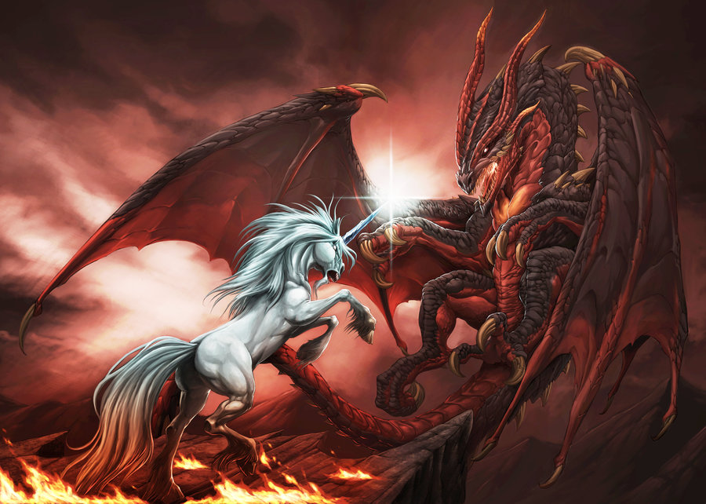

# 
Menace sur le Royaume de Diamant Éternel

Un mod développé sur <a href="https://www.baldursgateworld.fr">La Couronne de Cuivre</a> pour Baldur's Gate II: <acronym title="Throne of Bhaal">ToB</acronym>, Baldur's Gate Trilogy et <acronym title="Baldur's Gate II Enhanced Edition">BG2:EE</acronym>

<strong>Auteur :</strong> <a href="https://www.baldursgateworld.fr/lacouronne/members/freddy_gwendo.html">Freddy_Gwendo (aka Gwendolyne)</a> 
<strong>Version :</strong> 1.0.0 alpha 
<strong>Langue :</strong> français 
<a href="README_EN.md">English readme</a> 
<strong>Plateforme :</strong> Windows

<strong>Forum du mod :</strong> <a href="https://www.baldursgateworld.fr/lacouronne/menace-sur-le-royaume-de-diamant-eternel/">Menace sur le Royaume de Diamant Éternel</a>
  

## Présentation

Lux et Umbra by Chaos-Draco DeviantArt &copy;2009-2018 Chaos-Draco
 

<strong>Menace sur le royaume de Diamant Éternel</strong> est un mod français conçu à la frontière entre une conversion totale et une énorme quête. Une minuscule partie se situe dans BG2 Les Ombres d'Amn, mais l'essentiel se déroule dans l'extension Trône de Bhaal.  
Vous avez tous adoré Excalibur, mais vous êtes-vous jamais demandé pourquoi les seules femmes présentes y sont nuisibles ? Guenièvre l'adultère, Morgane la méchante... Pourquoi les Ordres de Paladins ne comportent-ils que des hommes ?  
Et si tout ceci n'était qu'une fable racontée par les hommes pour dissimuler la vérité ?  
Ce mod tente de rétablir la vérité, du moins SA VÉRITÉ...  
L'aventure se déroule dans une dimension parallèle, à la fois « proche » et « éloignée » de Féérune, plus précisément dans le Royaume de Diamant Éternel, un royaume dirigé par une dynastie de rois-paladins que tente de renverser une paladine renégate. Cette dernière a passé un pacte plutôt spécial avec des « forces » pour le moins particulières...   Le royaume tire sa richesse de ses mines et sa puissance de la protection que lui a toujours accordée le dragon d'argent Diamantor, considéré par certains comme un demi-dieu...

<em>Votre mission, si toutefois vous l'acceptez, est de sauver le Royaume de Diamant Éternel.</em>

Qui l'eut cru ? Plutôt original, non ? &#128541; 

Pour cela, vous devrez affronter une redoutable coalition formée par un Ordre de paladins félons pour le moins « dévoyés », une guilde d'assassins kamikazes et une compagnie de tueurs de magiciens (et oui, mauvais temps pour les amateurs des arcanes...).

Mais pas que... Il vous faudra aussi affronter une secte secrète, la Société des Crocs de Tiamat, et ses minions aux puissants pouvoirs de destruction. Libre à vous de choisir comment vous réglerez ces rencontres : avec la manière forte (à vos risques et périls) ou de manière plus subtile.

Je me suis en effet efforcé d'offrir autant que possible la possibilité de jouet cette aventure et d'accomplir ses quêtes sans avoir à combattre. Je préfère donc vous prévenir : les créatures que vous rencontrerez sont extrêmement puissantes. Alors, ne venez pas vous plaindre si vous préférez systématiquement les défier.

 

## Compatibilité

Ce mod est conçu pour fonctionner sur les jeux Infinity Engine suivants : Baldur's Gate II: Enhanced Edition (BG2EE), le jeu original Baldur's Gate II (Les Ombres d'Amn : BG2-SoA) avec son extension Trône de Bhaal (Throne of Bhaal : ToB), les mods de conversion Baldur's Gate Trilogy (BGT) et Enhanced Edition Trilogy (EET).

#### Mods pré-requis

Si vous jouez avec BG2-ToB ou BGT, je vous recommande fortement d'installer la dernière version du <a href="http://www.gibberlings3.net/bg2fixpack/">BG2 Fixpack</a> et <a href="http://www.shsforums.net/index.php?app=downloads&showfile=871"><acronym title="ToB">Throne of Bhaal Extender</acronym></a> avant d'installer ce mod.
 

De plus, Menace sur le Royaume de Diamant Éternel a été conçu pour exploiter les possibilités de modding offertes par les mods graphiques <a href="http://www.shsforums.net/index.php?app=downloads&showcat=98"><acronym title="IA">Infinity Animations</acronym></a> et <a href="http://www.shsforums.net/files/category/29-1pp/"><acronym title="1pp">One Pixel Productions</acronym></a>. Il ne s'installera pas s'il ne les détecte pas car il ne pourra pas installer les animations de licornes et de chevaux.
 

## Installation

#### Mise en garde

<em>Si une ancienne version de ce mod est déjà installée, il est nécessaire de la désinstaller d'abord. Pour cela, lancez <strong>setup-diamant_eternel.exe</strong>, et désinstallez tous les composants précédemment installés. Une fois la désinstallation achevée, supprimez le répertoire <strong>diamant_eternel</strong> et le fichier <strong>setup-diamant_eternel.exe</strong> (version Windows) avant d'extraire la nouvelle version du mod.</em>

<em>Lorsque vous installez ou désinstallez, <strong>ne fermez pas la fenêtre <acronym title="Disk Operating System">DOS</acronym></strong> en cliquant sur le bouton <strong>X</strong> ! Au lieu de cela, appuyez sur la touche <strong>Entrée</strong> lorsque l'invite de commandes vous le demande.</em>

<em>Par précaution, <strong>désactivez les antivirus</strong> ou tout logiciel résidant en mémoire avant d'installer ce mod, ou tout autre mod. Certains (en particulier avast et Norton !) ont une fâcheuse tendance à déclarer les exécutables des mods comme des faux positifs, provoquant ainsi l'échec de la procédure d'installation.</em> 

#### Note pour les jeux en Édition Améliorée (EE)

Les Éditions améliorées sont des jeux que le développeur fait encore évoluer, notamment par l'ajout de capacités supplémentaires destinées à la création de mods et par l'ajout de contenus. N'oubliez pas que chaque patch de mise à jour effacera les mods que vous avez installés ! Ce mod ne fera pas exception à la règle.

Si vous pouvez retarder la mise à jour du patch en plein milieu d'un partie moddée (si vous en avez la possibilité, notamment chez Beamdog et Good Old Games), n'oubliez pas que même après avoir réinstallé les mods sur un nouveau patch, vous ne pourrez peut-être pas continuer le jeu avec vos anciennes sauvegardes, en particulier à cause de noms de personnages, de lieux, etc, qui pourraient être incorrects. Pour y remédier, copiez tout le dossier du jeu dans un nouveau dossier dans lequel vous installerez vos mods, et qui ne sera pas modifié par les patches de mise à jour. Il est important que vous installiez le mod dans la version linguistique dans laquelle vous jouez. Sinon, les dialogues du mod ne s'afficheront pas et provoqueront des messages d'erreur.

#### &#9888;&#65039; Avertissement : procédure d'installation

###### Les variables nécessaires à l'installation sont lues dans le fichier <em><a href="
https://github.com/GwendolyneFreddy/Diamant-Eternel/master/diamant_eternel/diamant_eternel-config-default.ini">diamant_eternel-config-default.ini</a></em>, ou dans le fichier <em><a href="https://github.com/GwendolyneFreddy/Diamant-Eternel/master/diamant_eternel/diamant_eternel-config.ini">diamant_eternel-config.ini</a></em>, si ce dernier existe.

Pour éviter d'interrompre la procédure d'installation par de nombreux messages vous permettant de personnaliser certains composants à votre convenance, ces choix de variables ont été externalisés dans le fichier <a href="https://raw.githubusercontent.com/GwendolyneFreddy/Diamant-Eternel/master/diamant_eternel/diamant_eternel-config-default.ini">diamant_eternel-config-default.ini</a> situé dans le répertoire <strong>diamant_eternel</strong>. Ce fichier définit une installation « <em>standard</em> ».

Si vous souhaitez choisir d'autres options d'installation, il vous suffit de modifier les variables souhaitées dans le fichier <strong><em>diamant_eternel-config-default.ini</em></strong>, puis de sauvegarder ce dernier sous le nom <strong><em>diamant_eternel-config.ini</em></strong>.

Le programme d'installation lira les valeurs des variables dans les deux fichiers ini et donnera la priorité aux vôtres. Si le fichier diamant_eternel-config.ini contient une variable non conforme, ou si une variable est manquante, il la remplacera par sa valeur par défaut (celle correspondant à l'installation « <em>standard</em> »). 

Vous trouverez la liste des variables et leur signification dans le fichier <a href="https://raw.githubusercontent.com/GwendolyneFreddy/Diamant-Eternel/master/diamant_eternel/diamant_eternel-config-french.txt">diamant_eternel-config-language.txt</a> (« language » correspondant à la langue d'installation du mod). Voici le tableau des variables concernées : 

<table style="margin-left: 80px" summary="Liste des variables d'installation">
	<tr>
		<th>Variables</th>
		<th>Signification</th>
		<th>Type</th>
		<th>Valeurs possibles</th>
		<th>Défaut</th>
	</tr>
	<tr>
		<td style="padding-left:5px;padding-right:5px">gw_unicorn_name</td>
		<td style="padding-left:10px;padding-right:10px;text-align: justify">Le nom que vous souhaitez donner à votre licorne</td>
		<td>alphanumérique</td>
		<td>un nom !</td>
		<td><strong>Flèche d'argent<strong></td>
	</tr>
	<tr>
		<td style="padding-left:5px;padding-right:5px">gw_destrier_name</td>
		<td style="padding-left:10px;padding-right:10px;text-align: justify">Le nom que vous souhaitez donner à votre destrier de paladin</td>
		<td>alphanumérique</td>
		<td>un nom !</td>
		<td><strong>à trouver<strong></td>
	</tr>
	<tr>
		<td style="padding-left:5px;padding-right:5px">gw_language_bam</td>
		<td style="padding-left:10px;padding-right:10px;text-align: justify">Définit la langue dans laquelle vous souhaitez installer les fichiers BAM d'information : Langue d'installation (AUTO), VO (FR = français), anglais (US), allemand (GE), italien (IT), espagnol (SP) ou russe (RU).</td>
		<td>alphanumérique</td>
		<td>FR, US, GE, IT, RU ou SP</td>
		<td><strong>AUTO<strong></td>
	</tr>
	<tr>
		<td style="padding-left:5px;padding-right:5px">mymod_variable1</td>
		<td style="padding-left:10px;padding-right:10px;text-align: justify">définit blabla</td>
		<td>numérique</td>
		<td>1 ou 2</td>
		<td><strong>1<strong></td>
	</tr>
	<tr>
		<td style="padding-left:5px;padding-right:5px">mymod_variable2</td>
		<td style="padding-left:10px;padding-right:10px;text-align: justify">définit blabla</td>
		<td>numérique</td>
		<td>1, 2, 3 ou 4</td>
		<td><strong>2<strong></td>
	</tr>
</table> 

#### Windows

Menace sur le Royaume de Diamant Éternel pour Windows est livré et installé avec <acronym title="Weimer Dialogue Utility">WeiDU</acronym>, et est diffusé sous forme d'archive.

Vous devez extraire les fichiers de l'archive dans votre répertoire de jeu (<em>le dossier qui contient le fichier CHITIN.KEY</em>) à l'aide de <a href="http://www.7-zip.org/download.html">7zip</a> ou de <a href="http://www.rarlab.com/download.htm">WinRAR</a>. Une fois l'archive extraite correctement, vous devriez trouver le répertoire <strong>diamant_eternel</strong> et le fichier <strong>setup-diamant_eternel.exe</strong> dans votre répertoire de jeu. Pour installer le mod, il suffit de double-cliquer sur <strong>setup-diamant_eternel.exe</strong> et de suivre les instructions affichées à l'écran. 

Vous pouvez lancer <strong>setup-diamant_eternel.exe</strong> dans votre répertoire de jeu pour réinstaller, désinstaller, ou encore changer des composants.

#### Note pour effectuer une désinstallation complète

En plus des méthodes détaillées plus haut pour supprimer des composants, il est possible de désinstaller complètement le mod en tapant <strong>setup-diamant_eternel --uninstall</strong> dans une ligne de commandes, ce qui supprimera tous les composants sans devoir ingurgiter tous les messages.  

## Composants

Le programme d'installation comprend les composants suivants. Chacun possède un numéro distinct et pré-défini qui lui attribue une position déterminée (mot-clé <em>DESIGNATED</em> en langage WeiDU) ; ce qui permet aux autres composants de le détecter et aux utilitaires d'installation automatiques comme le BiG World Setup de préciser quels composants installer.

#### 10. Composant principal
  

## Captures d'écran
  

## Crédits et remerciements

#### Auteur : <a href="https://www.baldursgateworld.fr/lacouronne/members/freddy_gwendo.html">Freddy_Gwendo (aka Gwendolyne)</a>

#### Remerciements particuliers à :

- L'équipe de <a href="https://www.baldursgateworld.fr">La Couronne de Cuivre</a> pour l'hébergement de ce mod.
- Les créateurs de la série Baldur's Gate : <a href="http://www.bioware.com/">Bioware</a> et <a href="http://www.obsidian.net/">Black Isle Studios</a>.
- machin pour m'avoir donner la permission d'utiliser blabla.
- Isaya pour m'avoir aidé à coder.
- trucmuche pour son aide dans le codage et ses suggestions.
- bidule pour son aide dans la rédaction des dialogues.
- xxx pour la traduction française.
- yyy pour la relecture.
- Merci aux artistes de portraits du site <a href="https://www.pinterest.fr/">Pinterest</a>.
- Merci à toutes les personnes des forums de <a href="https://www.baldursgateworld.fr">La Couronne de Cuivre</a>, <a href="http://gibberlings3.net/forums/">The Gibberlings Three</a>, <a href="http://www.shsforums.net/">Spellhold Studios</a>, et des autres communautés de joueurs et de moddeurs IE qui m'ont offert leur aide.
- etc. à développer Luren, Deratiseur... Le Marquis... Paul Siramy

#### Logiciels et outils utilisés pour la réalisation de ce mod :

- <a href="http://www.weidu.org/%7Ethebigg/"><acronym title="Weimer Dialogue Utility">WeiDU</acronym></a> de Wes Weimer, the bigg et Wisp.
- <a href="http://forums.pocketplane.net/index.php/topic,25153.msg314249.html#msg314249">Near Infinity</a> de Jon Olav Hauglid, FredSRichardson et Argent77.
- <a href="http://www.gibberlings3.net/tools/dltcep.php"><acronym title="Dragonlance Total Conversion Editor Pro">DLTCEP</acronym></a> de Avenger.
- <a href="https://gibberlings3.github.io/iesdp/"><acronym title="Infinity Engine Structures Description Project">IESDP</acronym></a> maintenu par igi et lynx.
- <a href="http://www.gibberlings3.net/debug/">G3 Debugging Suite</a> de CamDawg.
- <a href="http://www.teambg.eu/?page=tools&amp;cat=32">BAM Workshop</a> de Glenn Flansburg.
- <a href="http://www.shsforums.net/topic/57564-bamworkshop/">BAMWorkshop 2</a> de Andrew Bridges.
- <a href="http://www.shsforums.net/index.php?showtopic=42359">BAM Batcher</a> de Miloch.
- <a href="https://www.adobe.com/products/photoshop.html">Adobe Photoshop</a>
- <a href="http://www.gimp.org/"><acronym title="GNU Image Manipulation Program">GIMP</acronym></a> par l'équipe de the GIMP.
- <a href="https://www.blender.org/">Blender</a> par la Fondation Blender.
- <a href="http://notepad-plus-plus.org/">Notepad++</a> par l'équipe de Notepad++, Don Ho, et le plug-in de correction orthographique.
- <a href="http://www.shsforums.net/files/file/1048-weidu-highlighter-for-notepad/">WeiDU Notepad++ Highlighters </a> de Argent77.
- <a href="http://www.bulkrenameutility.co.uk/">Bulk Rename Utility</a> de TGRMN Software.

#### Information sur les droits d'auteur

###### Menace sur le Royaume de Diamant Éternel n'est pas développé, supporté ni approuvé par BioWare&trade; ou Interplay/Black Isle, Overhaul, Beamdog ou Wizards of the Coast. Il a été développé par AUTEUR, et est basé sur le jeu Baldur's Gate II et son extension.
###### Baldur's Gate II : Les Ombres d'Amn et Baldur's Gate II : Trône de Bhaal appartiennent à &copy; TSR, Inc. Le moteur Infinity Engine appartient à &copy; BioWare Corp. Toutes les autres marques et droits d'auteur appartiennent à leurs propriétaires respectifs.

###### Ce mod a été créé pour être librement apprécié par tous les joueurs de Baldur's Gate II. Cependant, il ne doit pas être vendu, publié, compilé ou redistribué sous une forme quelconque sans le consentement de son auteur.

###### S'il existe des problèmes de droits d'auteur ou si cette déclaration nécessite une révision, veuillez me contacter et conseillez-moi sur ce qu'il faut faire à ce sujet. Plus particulièrement, si vous trouvez dans ce mod des illustrations susceptibles d'être en conflit avec les règles de droit d'auteur, merci de bien vouloir me le faire savoir dès que possible et je supprimerai immédiatement le contenu en conflit.

###### La communauté de modding sur le moteur Infinity Engine a été très active depuis plus de quinze ans maintenant, et a produit des milliers d'heures de travail non rémunérées effectuées par des fans du jeu. Les moddeurs s'efforcent de publier le meilleur de leur travail, et les joueurs bénéficient des mods les plus performants et les mieux maintenus, à condition que nous travaillions tous dans le même sens.
###### Mais cette harmonie peut malheureusement être perturbée, principalement par deux comportements. Le premier, c'est de revendiquer le travail de quelqu'un d'autre. Le second consiste à héberger et à redistribuer un mod sans la permission de son(es) auteur(s).
###### Soyez assez sympa avec vos collègues joueurs et moddeurs. Ne le faites pas.  

## Historique des versions

#### Version beta 1.0.0 - jour mois 201x
- Sortie initiale.
